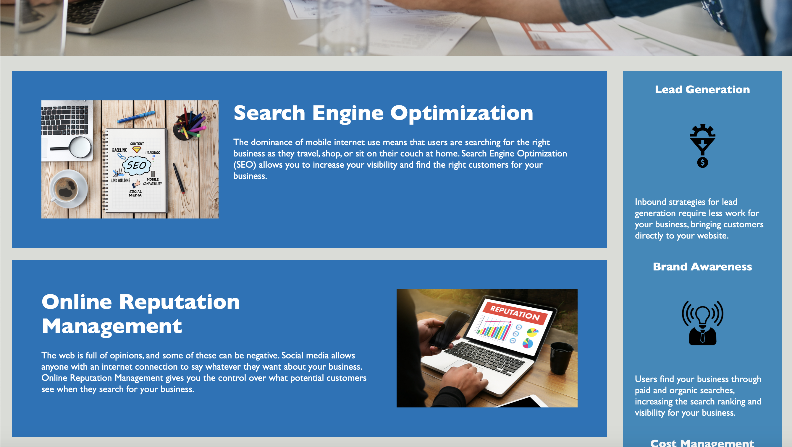
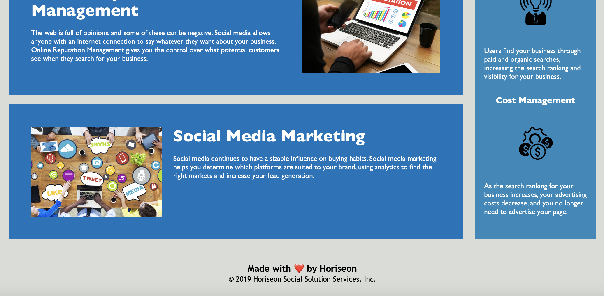

# coderefractordemo
UCLA Homework assignment #1
# Refractoring Horiseon's Information Website
The task included refractoring Horiseon's website to improve accessibility
 
See below final webpage

# Features
Improved accessibility
 
Fixed linkage issues
 
Improved code readability and organization 
# Live Website Link
Live Website : https://avabrenneke.github.io/coderefractordemo/#online-reputation-management
